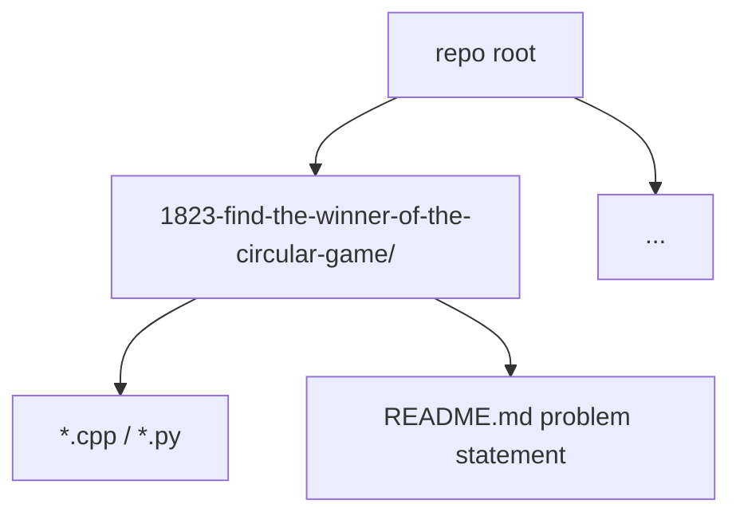

# LeetCode

Archive of **750+** accepted solutions synced from the platform. Each problem is a directory named `{id}-{slug}/` with source, optional notes, and upstream problem README when present.

## Scale and shape

| Property | Detail |
| --- | --- |
| Problems | 750+ folders on `main` |
| Primary language | C++ (competitive-style solutions) |
| Also | Python / Java in select folders |
| Sync | Git pull from GitHub is source of truth; run `git pull origin main` before local edits |

There is **no monorepo build**. Compile per problem with the toolchain noted in that folder (g++, local script, or IDE).

## Conventions

- Directory name matches LeetCode slug for searchability
- Commit messages from sync often include judged runtime and memory percentages
- Keep upstream statements in per-problem READMEs; solution files stay minimal

## Why this repo exists

Dense record of algorithm practice: arrays, graphs, DP, heaps, strings, and system-style prompts. Useful as a searchable reference for patterns and complexity tradeoffs, not as a library.

## License

Solution code is personal reference. Problem statements belong to LeetCode where applicable.
