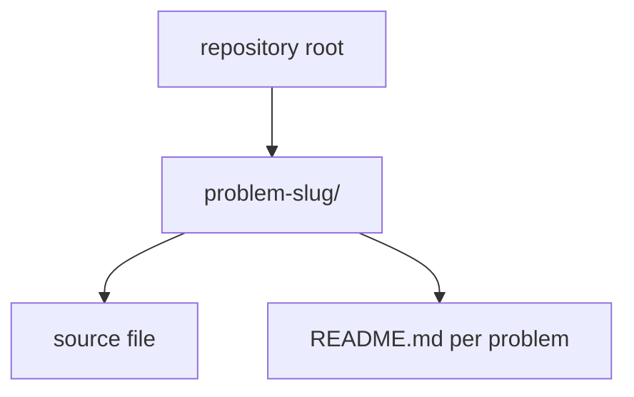

# Leetcode archive

Personal record of accepted solutions synced from Leetcode. Each problem lives in
its own directory with source, notes, and upstream problem README when present.

## Layout



Roughly 750+ problem folders under `main`, grouped by slug (for example
`1-two-sum/`). Language mix is mostly C++ with occasional Python or Java where
noted in the folder.

## Workflow

Solutions are updated through Leetcode sync tooling; pull before working locally
so this clone matches GitHub:

```bash
git pull origin main
```

There is no build step for the archive as a whole. Open an individual solution
file in your editor or compile it with the toolchain named in that problem's
notes.

## Conventions

- One directory per problem, named with Leetcode id and slug
- Prefer keeping upstream problem statements in the per-problem README
- Commit messages from sync often include runtime and memory stats from submission

## License

Solutions are for personal reference. Problem statements remain Leetcode property
where applicable.
